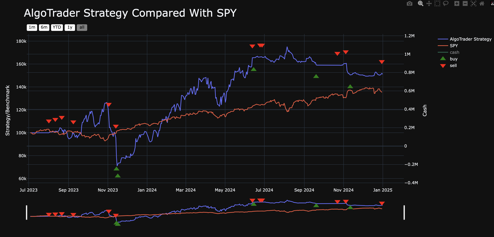
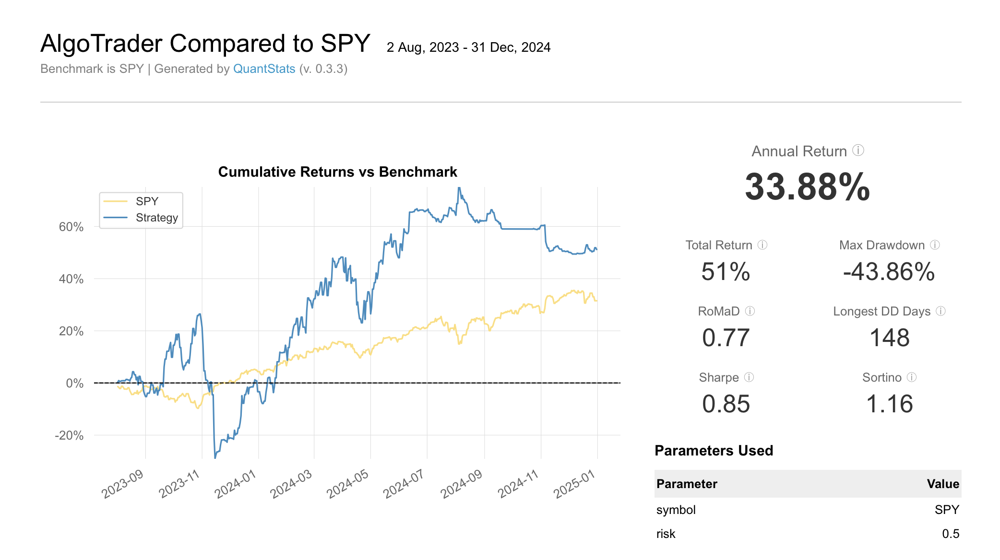

# AlgoTrader Bot

AlgoTrader is an AI-powered algorithmic trading bot that combines sentiment analysis and LSTM neural networks to make trading decisions. The bot uses multiple technical indicators along with news sentiment to determine optimal entry and exit points in the market.





## Features

- LSTM neural network for price movement prediction
- FinBERT sentiment analysis of market news
- Dynamic threshold calculation based on market volatility
- Technical indicators including Bollinger Bands, ATR, and RSI
- Automated bracket orders with take-profit and stop-loss
- Backtesting capabilities using historical market data

## Architecture

The system consists of two main components:

1. **LSTM Model** - A deep learning model for price prediction
2. **AlgoTrader Strategy** - A trading strategy implementation using Lumibot

## Setup Instructions

### Prerequisites

- Python 3.8+
- Alpaca trading account with API keys

### Installation

1. Clone the repository:
   ```bash
   git clone https://github.com/akshatmardia/trading-bot.git
   cd trading-bot
   ```

2. Create and activate a virtual environment:
   ```bash
   python -m venv venv
   
   # On Windows
   venv\Scripts\activate
   
   # On macOS/Linux
   source venv/bin/activate
   ```

3. Install dependencies:
   ```bash
   pip install -r requirements.txt
   ```

4. Configure your Alpaca API credentials:
   - Open `algotrader.py`
   - Replace the placeholder API values:
     ```python
     API_KEY = "YOUR_ALPACA_API_KEY"
     API_SECRET = "YOUR_ALPACA_API_SECRET"
     BASE_URL = "YOUR_URL"  # Use paper trading URL
     ```

### Training the LSTM Model

Before using the trading strategy, you need to train the LSTM model:

```bash
python lstm.py
```

This will:
1. Download historical data for SPY from Yahoo Finance
2. Calculate technical indicators (Bollinger Bands, ATR, RSI)
3. Train the LSTM model on this data
4. Save the model weights to `lstm_model.pth`
5. Save the scaler to `lstm_scaler.joblib`

## Running the Trading Bot

### Backtesting

To run a backtest of the strategy:

```bash
python algotrader.py
```

This will run a backtest from whatever dates specified using Yahoo Finance data.

Make sure your API credentials are correctly set up for paper trading.

## How It Works

### LSTM Model

The LSTM (Long Short-Term Memory) neural network is designed to predict price movements based on historical price data and technical indicators:

- **Input Features**: Close prices, Bollinger Bands, ATR, and RSI
- **Model Architecture**: 2-layer LSTM with 50 hidden units followed by a fully connected layer
- **Output**: Predicted price *change* for the next day
- **Training**: The model is trained on historical data.

The `LSTMPredictor` class uses PyTorch to implement the neural network. The model takes normalized input features and outputs a predicted price change value.

### Technical Indicators

The system uses several technical indicators:

- **Bollinger Bands**: Measure price volatility using standard deviations from a moving average
- **Average True Range (ATR)**: Measures market volatility based on price ranges
- **Relative Strength Index (RSI)**: Measures the speed and change of price movements

### Trading Strategy

The `AlgoTrader` class implements the trading logic:

1. **Sentiment Analysis**: Uses FinBERT to analyze news sentiment for the trading symbol
2. **Price Prediction**: Employs the trained LSTM model to predict price movements
3. **Decision Making**: Combines sentiment analysis and LSTM predictions with a dynamic threshold
4. **Position Sizing**: Calculates position size based on available capital and risk tolerance
5. **Order Execution**: Creates bracket orders with take-profit and stop-loss levels

The strategy executes once per day and makes decisions based on:
- Positive sentiment with high probability OR predicted price increase above threshold → BUY
- Negative sentiment with high probability OR predicted price decrease below threshold → SELL

### Dynamic Threshold

The system calculates a dynamic threshold based on recent market volatility, making it adaptable to changing market conditions.

## Important Note

It is to be noted that AlgoBot is a backtesting program and should not be used for live trading since that would almost always lead to a financial loss. Much more complexity can be added and the model can be fine tuned but if you are able to be profitable, you should be on Wall Street.